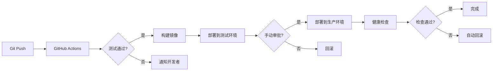

# 系统架构设计文档
# NeoBund1.com - System Architecture

**版本**: 1.0
**日期**: 2026-02-15
**架构师**: AI Assistant
**技术栈**: Next.js 15 + FastAPI + Supabase + Trigger.dev

---

## 目录

1. [架构概述](#1-架构概述)
2. [技术栈选型](#2-技术栈选型)
3. [系统架构图](#3-系统架构图)
4. [API 设计](#4-api-设计)
5. [部署架构](#5-部署架构)
6. [安全架构](#6-安全架构)
7. [性能优化](#7-性能优化)
8. [监控与日志](#8-监控与日志)

---

## 1. 架构概述

### 1.1 架构风格

采用 **前后端分离 + 微服务** 架构：

- **前端**: Next.js 15 (App Router) - SSR/SSG 混合渲染
- **后端**: FastAPI (Python) - RESTful API + WebSocket
- **数据库**: Supabase (PostgreSQL) - BaaS 平台
- **异步任务**: Trigger.dev - 视频生成任务队列
- **存储**: Supabase Storage - 文件存储
- **认证**: Supabase Auth - JWT 认证

### 1.2 设计原则

1. **关注点分离**: 前端负责展示，后端负责业务逻辑
2. **可扩展性**: 微服务架构，易于横向扩展
3. **高可用性**: 多副本部署，故障自动转移
4. **安全第一**: 多层安全防护，数据加密
5. **性能优先**: CDN 加速，缓存策略，异步处理

### 1.3 核心组件

```
┌─────────────────────────────────────────────────────────┐
│                    用户浏览器                              │
└─────────────────────────────────────────────────────────┘
                          │
                          ▼
┌─────────────────────────────────────────────────────────┐
│                  Vercel CDN (全球加速)                     │
└─────────────────────────────────────────────────────────┘
                          │
                          ▼
┌─────────────────────────────────────────────────────────┐
│              Next.js 15 Frontend (SSR/SSG)               │
│  - App Router                                            │
│  - Server Components                                     │
│  - Client Components                                     │
└─────────────────────────────────────────────────────────┘
                          │
                          ▼
┌─────────────────────────────────────────────────────────┐
│                  FastAPI Backend                         │
│  - RESTful API                                           │
│  - WebSocket (实时进度)                                   │
│  - AI 模型集成                                            │
└─────────────────────────────────────────────────────────┘
                          │
        ┌─────────────────┼─────────────────┐
        ▼                 ▼                 ▼
┌──────────────┐  ┌──────────────┐  ┌──────────────┐
│   Supabase   │  │  Trigger.dev │  │  AI Models   │
│  (Database)  │  │  (Async Jobs)│  │ (Sora2/Veo3) │
└──────────────┘  └──────────────┘  └──────────────┘
```

---

## 2. 技术栈选型

### 2.1 前端技术栈

| 技术 | 版本 | 用途 | 选型理由 |
|------|------|------|----------|
| **Next.js** | 15.x | React 框架 | App Router、SSR/SSG、性能优化 |
| **React** | 19.x | UI 库 | 组件化、生态丰富 |
| **TypeScript** | 5.x | 类型系统 | 类型安全、代码提示 |
| **Tailwind CSS** | 4.x | 样式框架 | 快速开发、一致性 |
| **Radix UI** | Latest | 无头组件 | 可访问性、可定制 |
| **Zustand** | 4.x | 状态管理 | 轻量、简单 |
| **React Hook Form** | 7.x | 表单处理 | 性能好、验证强 |
| **Zod** | 3.x | 数据验证 | 类型安全验证 |
| **TanStack Query** | 5.x | 数据获取 | 缓存、自动重试 |
| **Framer Motion** | 11.x | 动画库 | 流畅动画 |

### 2.2 后端技术栈

| 技术 | 版本 | 用途 | 选型理由 |
|------|------|------|----------|
| **FastAPI** | 0.110+ | Web 框架 | 高性能、自动文档、异步支持 |
| **Python** | 3.11+ | 编程语言 | AI 生态丰富 |
| **Pydantic** | 2.x | 数据验证 | 类型安全、自动验证 |
| **SQLAlchemy** | 2.x | ORM | 数据库抽象 |
| **Alembic** | 1.x | 数据库迁移 | 版本控制 |
| **httpx** | 0.27+ | HTTP 客户端 | 异步请求 |
| **python-jose** | 3.x | JWT 处理 | Token 生成验证 |
| **passlib** | 1.7+ | 密码加密 | bcrypt 加密 |

### 2.3 基础设施

| 服务 | 提供商 | 用途 | 选型理由 |
|------|--------|------|----------|
| **Supabase** | Supabase | 数据库+认证+存储 | 开箱即用、RLS、实时订阅 |
| **Trigger.dev** | Trigger.dev | 异步任务 | 可视化、重试机制、监控 |
| **Vercel** | Vercel | 前端部署 | 零配置、全球 CDN、自动扩展 |
| **Railway** | Railway | 后端部署 | 简单、自动部署、日志 |
| **Stripe** | Stripe | 支付 | 安全、全球支持 |
| **Resend** | Resend | 邮件 | 开发者友好、高送达率 |
| **Sentry** | Sentry | 错误监控 | 实时告警、性能监控 |

### 2.4 AI 模型集成

| 模型 | 提供商 | 用途 | API |
|------|--------|------|-----|
| **Sora2** | OpenAI | 视频生成 | REST API |
| **Veo3.1 Fast** | Google | 视频生成 | REST API |
| **GPT-4** | OpenAI | 提示词优化 | REST API |
| **DALL-E 3** | OpenAI | 图片生成 | REST API |

---

## 3. 系统架构图

### 3.1 整体架构

```
┌─────────────────────────────────────────────────────────────────┐
│                          Client Layer                            │
│  ┌──────────────┐  ┌──────────────┐  ┌──────────────┐          │
│  │   Browser    │  │    Mobile    │  │   Desktop    │          │
│  │   (Chrome)   │  │   (Safari)   │  │   (Electron) │          │
│  └──────────────┘  └──────────────┘  └──────────────┘          │
└─────────────────────────────────────────────────────────────────┘
                              │
                              ▼
┌─────────────────────────────────────────────────────────────────┐
│                          CDN Layer                               │
│  ┌──────────────────────────────────────────────────────────┐  │
│  │              Vercel Edge Network (全球)                    │  │
│  │  - Static Assets (JS/CSS/Images)                          │  │
│  │  - SSG Pages (Landing/Showcase)                           │  │
│  │  - Edge Functions (Middleware)                            │  │
│  └──────────────────────────────────────────────────────────┘  │
└─────────────────────────────────────────────────────────────────┘
                              │
                              ▼
┌─────────────────────────────────────────────────────────────────┐
│                      Application Layer                           │
│  ┌────────────────────────────────────────────────────────┐    │
│  │              Next.js 15 Frontend (Vercel)               │    │
│  │  ┌──────────────┐  ┌──────────────┐  ┌─────────────┐  │    │
│  │  │ App Router   │  │   Server     │  │   Client    │  │    │
│  │  │   (Pages)    │  │  Components  │  │ Components  │  │    │
│  │  └──────────────┘  └──────────────┘  └─────────────┘  │    │
│  └────────────────────────────────────────────────────────┘    │
│                              │                                   │
│                              ▼                                   │
│  ┌────────────────────────────────────────────────────────┐    │
│  │              FastAPI Backend (Railway)                  │    │
│  │  ┌──────────────┐  ┌──────────────┐  ┌─────────────┐  │    │
│  │  │  REST API    │  │  WebSocket   │  │  AI Service │  │    │
│  │  │  Endpoints   │  │   (Progress) │  │  Integrator │  │    │
│  │  └──────────────┘  └──────────────┘  └─────────────┘  │    │
│  └────────────────────────────────────────────────────────┘    │
└─────────────────────────────────────────────────────────────────┘
                              │
        ┌─────────────────────┼─────────────────────┐
        ▼                     ▼                     ▼
┌──────────────┐    ┌──────────────┐    ┌──────────────┐
│   Supabase   │    │  Trigger.dev │    │  AI Models   │
│              │    │              │    │              │
│ - PostgreSQL │    │ - Task Queue │    │ - Sora2 API  │
│ - Auth       │    │ - Scheduler  │    │ - Veo3.1 API │
│ - Storage    │    │ - Monitoring │    │ - GPT-4 API  │
│ - Realtime   │    │              │    │              │
└──────────────┘    └──────────────┘    └──────────────┘
```

### 3.2 数据流架构

```
用户操作 → Next.js Frontend → FastAPI Backend → Supabase Database
                                      ↓
                              Trigger.dev (异步任务)
                                      ↓
                              AI Model API (Sora2/Veo3)
                                      ↓
                              Supabase Storage (视频存储)
                                      ↓
                              WebSocket 推送进度
                                      ↓
                              Frontend 更新 UI
```

---

## 4. API 设计

### 4.1 API 规范

- **协议**: HTTPS
- **格式**: JSON
- **认证**: Bearer Token (JWT)
- **版本**: `/api/v1/`
- **文档**: OpenAPI 3.0 (Swagger UI)

### 4.2 核心 API 端点

#### 4.2.1 认证 API

```
POST   /api/v1/auth/register          # 用户注册
POST   /api/v1/auth/login             # 用户登录
POST   /api/v1/auth/logout            # 用户登出
POST   /api/v1/auth/refresh           # 刷新 Token
GET    /api/v1/auth/me                # 获取当前用户信息
```

#### 4.2.2 项目 API

```
GET    /api/v1/projects               # 获取项目列表
POST   /api/v1/projects               # 创建项目
GET    /api/v1/projects/:id           # 获取项目详情
PATCH  /api/v1/projects/:id           # 更新项目
DELETE /api/v1/projects/:id           # 删除项目
```

#### 4.2.3 视频生成 API

```
POST   /api/v1/generate/one-click     # 一键成片
POST   /api/v1/generate/digital-human # 数字人生成
POST   /api/v1/generate/viral-clone   # 爆款复刻
GET    /api/v1/generate/tasks/:id     # 获取任务状态
WS     /api/v1/ws/tasks/:id           # WebSocket 实时进度
```

#### 4.2.4 素材 API

```
POST   /api/v1/assets/upload          # 上传素材
GET    /api/v1/assets                 # 获取素材列表
DELETE /api/v1/assets/:id             # 删除素材
```

#### 4.2.5 案例库 API

```
GET    /api/v1/showcase/cases         # 获取案例列表
GET    /api/v1/showcase/cases/:id     # 获取案例详情
POST   /api/v1/showcase/favorites     # 收藏案例
DELETE /api/v1/showcase/favorites/:id # 取消收藏
```

#### 4.2.6 积分 API

```
GET    /api/v1/credits/balance        # 获取积分余额
GET    /api/v1/credits/transactions   # 获取交易记录
POST   /api/v1/credits/purchase       # 购买积分
```

### 4.3 API 请求/响应示例

#### 创建项目

**请求**:
```http
POST /api/v1/projects
Authorization: Bearer <token>
Content-Type: application/json

{
  "title": "我的第一个视频",
  "project_type": "one_click_advanced",
  "config": {
    "product_details": "金铆钉骷髅耳环...",
    "language": "chinese",
    "digital_human_id": "uuid-xxx",
    "run_mode": "semi_auto"
  }
}
```

**响应**:
```json
{
  "id": "uuid-xxx",
  "title": "我的第一个视频",
  "status": "draft",
  "created_at": "2026-02-15T10:00:00Z"
}
```

#### 生成视频

**请求**:
```http
POST /api/v1/generate/one-click
Authorization: Bearer <token>
Content-Type: application/json

{
  "project_id": "uuid-xxx",
  "model_version": "Sora2",
  "credits_cost": 10
}
```

**响应**:
```json
{
  "task_id": "uuid-yyy",
  "status": "pending",
  "estimated_time": 60,
  "websocket_url": "wss://api.neobund1.com/ws/tasks/uuid-yyy"
}
```

### 4.4 错误处理

统一错误响应格式：

```json
{
  "error": {
    "code": "INSUFFICIENT_CREDITS",
    "message": "积分不足，需要 10 积分",
    "details": {
      "required": 10,
      "available": 5
    }
  }
}
```

**错误码**:
- `400` - 请求参数错误
- `401` - 未认证
- `403` - 无权限
- `404` - 资源不存在
- `429` - 请求过于频繁
- `500` - 服务器错误

---

## 5. 部署架构

### 5.1 环境划分

| 环境 | 用途 | 域名 | 部署平台 |
|------|------|------|----------|
| **开发环境** | 本地开发 | localhost:3000 | 本地 |
| **测试环境** | 功能测试 | test.neobund1.com | Vercel Preview |
| **预发布环境** | 上线前验证 | staging.neobund1.com | Vercel |
| **生产环境** | 正式服务 | neobund1.com | Vercel + Railway |

### 5.2 前端部署 (Vercel)

```yaml
# vercel.json
{
  "buildCommand": "npm run build",
  "outputDirectory": ".next",
  "framework": "nextjs",
  "regions": ["hkg1", "sfo1", "fra1"],  # 香港、旧金山、法兰克福
  "env": {
    "NEXT_PUBLIC_API_URL": "@api-url",
    "NEXT_PUBLIC_SUPABASE_URL": "@supabase-url",
    "NEXT_PUBLIC_SUPABASE_ANON_KEY": "@supabase-anon-key"
  }
}
```

**部署流程**:
1. 推送代码到 GitHub
2. Vercel 自动触发构建
3. 构建成功后自动部署
4. 生成预览 URL（PR）或更新生产环境

### 5.3 后端部署 (Railway)

```yaml
# railway.toml
[build]
builder = "NIXPACKS"
buildCommand = "pip install -r requirements.txt"

[deploy]
startCommand = "uvicorn main:app --host 0.0.0.0 --port $PORT"
healthcheckPath = "/health"
healthcheckTimeout = 100
restartPolicyType = "ON_FAILURE"
restartPolicyMaxRetries = 10

[env]
DATABASE_URL = "${{Postgres.DATABASE_URL}}"
SUPABASE_URL = "${{SUPABASE_URL}}"
SUPABASE_KEY = "${{SUPABASE_KEY}}"
```

**部署流程**:
1. 推送代码到 GitHub
2. Railway 自动触发构建
3. 运行数据库迁移
4. 启动 FastAPI 服务
5. 健康检查通过后切换流量

### 5.4 数据库部署 (Supabase)

**配置**:
- **实例类型**: Starter (免费) → Pro ($25/月)
- **区域**: Singapore (亚太)
- **备份**: 每日自动备份，保留 7 天
- **扩展**: pgvector (向量搜索), pg_cron (定时任务)

**迁移流程**:
```bash
# 本地开发
supabase db reset
supabase db push

# 生产环境
supabase db push --linked
```

### 5.5 CI/CD 流程



---

## 6. 安全架构

### 6.1 认证与授权

**认证流程**:
```
1. 用户登录 → Supabase Auth
2. 返回 JWT Token (access_token + refresh_token)
3. 前端存储 Token (httpOnly Cookie)
4. 每次请求携带 Token
5. 后端验证 Token (JWT 签名验证)
6. 检查 RLS 策略
7. 返回数据
```

**Token 策略**:
- `access_token`: 1小时有效期
- `refresh_token`: 30天有效期
- 自动刷新机制（前端拦截器）

### 6.2 数据安全

| 层级 | 措施 | 说明 |
|------|------|------|
| **传输层** | HTTPS/TLS 1.3 | 所有通信加密 |
| **应用层** | JWT + RLS | 认证授权 |
| **数据层** | 数据库加密 | 静态数据加密 |
| **存储层** | 文件加密 | 敏感文件加密 |

### 6.3 安全防护

**OWASP Top 10 防护**:
1. **SQL 注入**: 使用 ORM + 参数化查询
2. **XSS**: React 自动转义 + CSP 策略
3. **CSRF**: SameSite Cookie + CSRF Token
4. **认证失效**: JWT + 短期 Token + 刷新机制
5. **敏感数据泄露**: 加密存储 + HTTPS
6. **访问控制**: RLS + RBAC
7. **安全配置错误**: 环境变量 + 最小权限
8. **反序列化**: Pydantic 验证
9. **组件漏洞**: 定期更新依赖
10. **日志监控**: Sentry + 审计日志

**速率限制**:
```python
# FastAPI 中间件
from slowapi import Limiter
from slowapi.util import get_remote_address

limiter = Limiter(key_func=get_remote_address)

@app.post("/api/v1/generate/one-click")
@limiter.limit("10/minute")  # 每分钟最多 10 次
async def generate_video():
    pass
```

---

## 7. 性能优化

### 7.1 前端优化

| 策略 | 实现 | 效果 |
|------|------|------|
| **代码分割** | Next.js 动态导入 | 减少首屏加载 |
| **图片优化** | next/image + WebP | 减少 60% 体积 |
| **字体优化** | next/font + 子集化 | 减少字体加载时间 |
| **缓存策略** | SWR + TanStack Query | 减少重复请求 |
| **SSG** | 静态生成案例页 | 秒开 |
| **ISR** | 增量静态再生 | 动态更新 |
| **预加载** | Link prefetch | 提前加载 |

### 7.2 后端优化

| 策略 | 实现 | 效果 |
|------|------|------|
| **数据库连接池** | SQLAlchemy pool_size=20 | 减少连接开销 |
| **查询优化** | 索引 + EXPLAIN ANALYZE | 加速查询 |
| **缓存** | Redis (未来) | 减少数据库压力 |
| **异步处理** | Trigger.dev | 不阻塞主线程 |
| **CDN** | Supabase Storage + CDN | 加速文件访问 |

### 7.3 性能指标

**目标**:
- **TTFB**: ≤200ms
- **FCP**: ≤1.5s
- **LCP**: ≤2.5s
- **CLS**: ≤0.1
- **FID**: ≤100ms

---

## 8. 监控与日志

### 8.1 监控体系

| 类型 | 工具 | 监控内容 |
|------|------|----------|
| **错误监控** | Sentry | 前后端错误、性能 |
| **性能监控** | Vercel Analytics | Core Web Vitals |
| **日志监控** | Railway Logs | 应用日志 |
| **数据库监控** | Supabase Dashboard | 查询性能、连接数 |
| **业务监控** | 自定义 Dashboard | 用户量、生成量、积分消耗 |

### 8.2 日志规范

**日志级别**:
- `DEBUG`: 调试信息
- `INFO`: 一般信息
- `WARNING`: 警告信息
- `ERROR`: 错误信息
- `CRITICAL`: 严重错误

**日志格式**:
```json
{
  "timestamp": "2026-02-15T10:00:00Z",
  "level": "INFO",
  "service": "fastapi-backend",
  "user_id": "uuid-xxx",
  "action": "generate_video",
  "message": "Video generation started",
  "metadata": {
    "project_id": "uuid-yyy",
    "model": "Sora2"
  }
}
```

### 8.3 告警策略

**告警规则**:
- 错误率 > 1%: 立即告警
- 响应时间 > 2s: 警告
- 数据库连接数 > 80%: 警告
- 磁盘使用率 > 90%: 紧急告警
- 服务不可用: 立即告警

**告警渠道**:
- Email
- Slack
- 短信（紧急）

---

## 9. 扩展性设计

### 9.1 水平扩展

**前端**:
- Vercel 自动扩展（无需配置）
- 全球 CDN 节点

**后端**:
- Railway 手动扩展（增加实例数）
- 负载均衡（Railway 内置）

**数据库**:
- Supabase 垂直扩展（升级实例）
- 读写分离（未来）

### 9.2 微服务拆分（未来）

```
当前: Monolith FastAPI
未来:
  - Auth Service (认证服务)
  - Video Service (视频生成服务)
  - Payment Service (支付服务)
  - Notification Service (通知服务)
```

---

**文档版本**: 1.0
**最后更新**: 2026-02-15
**状态**: Phase 2 完成
**下一步**: Phase 3 - 后端基础设施实现
