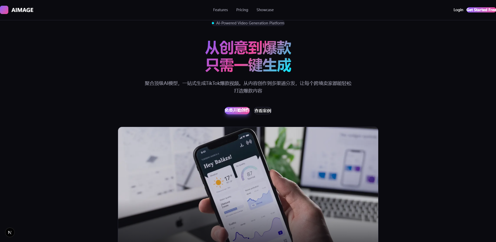

# AIMAGE - AI视频生成平台


**一键生成专业级产品视频的AI平台**

[](https://nextjs.org/)
[](https://www.typescriptlang.org/)
[](https://tailwindcss.com/)
[](https://supabase.com/)

`</div>`

## 📖 项目简介

AIMAGE 是一个基于 AI 的视频生成平台，专注于为电商、品牌和内容创作者提供快速、专业的产品视频生成服务。通过简单的文字描述或上传素材，即可生成高质量的产品展示视频。

### ✨ 核心功能

- 🎬 **一键成片** - 基础模式和高级模式，满足不同需求
- 📁 **项目管理** - 完整的项目生命周期管理
- 🎭 **数字人管理** - 自定义数字人形象和声音
- 🎨 **案例库** - 精选优秀案例，获取创作灵感
- 💳 **积分系统** - 灵活的积分充值和消费机制
- 👤 **用户中心** - 个人信息管理和账户设置

## 🚀 快速开始

### 环境要求

- Node.js 18.0 或更高版本
- Python 3.14 或更高版本
- pnpm 8.0 或更高版本
- Supabase 账号

### 安装步骤

#### 前端设置

1. **克隆项目**

```bash
git clone https://github.com/yourusername/aimage.git
cd aimage
```

2. **安装前端依赖**

```bash
cd frontend
pnpm install
```

3. **配置前端环境变量**

在 `frontend` 目录下创建 `.env.local` 文件：

```env
# Supabase Configuration
NEXT_PUBLIC_SUPABASE_URL=your_supabase_url
NEXT_PUBLIC_SUPABASE_ANON_KEY=your_supabase_anon_key

# Backend API
NEXT_PUBLIC_API_URL=http://localhost:8002
```

#### 后端设置

1. **安装后端依赖**

```bash
cd backend
pip install -r requirements.txt
```

2. **配置后端环境变量**

在 `backend` 目录下创建 `.env` 文件：

```env
# Supabase
SUPABASE_URL=your_supabase_url
SUPABASE_KEY=your_supabase_anon_key
SUPABASE_SERVICE_ROLE_KEY=your_supabase_service_role_key

# Database
DATABASE_URL=your_postgresql_connection_string

# JWT
JWT_SECRET=your-jwt-secret-here
JWT_ALGORITHM=HS256

# CORS
CORS_ORIGINS=["http://localhost:3000","http://localhost:3002","http://localhost:3005"]

# AI Models - Alibaba Cloud DashScope
DASHSCOPE_API_KEY=your_dashscope_api_key
DASHSCOPE_BASE_URL=https://dashscope.aliyuncs.com

# DeepSeek API
DEEPSEEK_API_KEY=your_deepseek_api_key
DEEPSEEK_BASE_URL=https://api.deepseek.com
```

#### 数据库设置

4. **配置数据库**

在 Supabase 中执行以下 SQL 文件：

- `supabase/complete_migration.sql` - 完整的数据库结构
- `supabase/migrations/20260215121200_seed_showcase_cases.sql` - 示例数据

5. **配置 Storage**

按照 `SUPABASE_STORAGE_SETUP.md` 文档配置 Supabase Storage。

#### 启动服务

6. **启动后端服务**

```bash
cd backend
python -m uvicorn main:app --host 127.0.0.1 --port 8002 --reload
```

后端将运行在 [http://localhost:8002](http://localhost:8002)

7. **启动前端服务**

```bash
cd frontend
pnpm dev
```

前端将运行在 [http://localhost:3000](http://localhost:3000)

## 📁 项目结构

```
aimage/
├── frontend/                 # 前端应用 (Next.js)
│   ├── app/                 # Next.js 应用目录
│   │   ├── dashboard/       # 工作台
│   │   ├── projects/        # 项目管理
│   │   ├── showcase/        # 案例库
│   │   ├── generate/        # 一键成片
│   │   ├── digital-humans/  # 数字人管理
│   │   ├── credits/         # 积分充值
│   │   ├── settings/        # 用户设置
│   │   ├── login/           # 登录
│   │   └── signup/          # 注册
│   ├── components/          # 通用组件
│   │   ├── Header.tsx       # 导航栏
│   │   ├── Modal.tsx        # 模态框
│   │   ├── FileUpload.tsx   # 文件上传
│   │   ├── Loading.tsx      # 加载组件
│   │   └── ErrorBoundary.tsx # 错误边界
│   ├── lib/                 # 工具库
│   │   ├── supabase.ts      # Supabase 客户端
│   │   └── store.ts         # 状态管理
│   └── public/              # 静态资源
├── backend/                 # 后端应用 (FastAPI)
│   ├── app/
│   │   ├── api/v1/         # API 路由
│   │   │   ├── auth.py     # 认证接口
│   │   │   ├── projects.py # 项目管理
│   │   │   ├── generate.py # 视频生成
│   │   │   ├── digital_humans.py # 数字人管理
│   │   │   └── credits.py  # 积分管理
│   │   ├── core/           # 核心配置
│   │   │   ├── config.py   # 应用配置
│   │   │   └── security.py # 安全相关
│   │   ├── db/             # 数据库
│   │   │   └── supabase.py # Supabase 客户端
│   │   ├── services/       # 业务逻辑
│   │   │   └── ai_service.py # AI 服务集成
│   │   └── schemas/        # 数据模型
│   └── main.py             # 应用入口
├── supabase/               # 数据库配置
│   ├── migrations/         # 数据库迁移文件
│   └── complete_migration.sql # 完整数据库结构
├── add_credits.py          # 积分管理工具
├── .gitignore              # Git 忽略文件
├── PROGRESS_2026-02-15.md  # 开发进度
├── QUICK_START_TESTING.md  # 快速测试指南
├── SUPABASE_STORAGE_SETUP.md # Storage 配置指南
└── README.md               # 项目文档
```

## 🛠️ 技术栈

### 前端

- **框架**: Next.js 15 (App Router)
- **语言**: TypeScript 5.0
- **样式**: Tailwind CSS 4.0
- **状态管理**: Zustand
- **UI组件**: 自定义组件库

### 后端

- **框架**: FastAPI
- **语言**: Python 3.14
- **数据库**: Supabase (PostgreSQL)
- **认证**: Supabase Auth
- **存储**: Supabase Storage
- **AI服务**:
  - 阿里云 DashScope (通义千问)
  - DeepSeek API

### 部署

- **前端**: Vercel
- **后端**: 自托管 / 云服务器
- **数据库**: Supabase Cloud

## 📊 数据库结构

### 核心表

- **users** - 用户信息
- **projects** - 项目管理
- **generation_tasks** - 生成任务
- **assets** - 素材管理
- **project_assets** - 项目素材关联
- **showcase_cases** - 案例库
- **credit_transactions** - 积分交易记录

详细的数据库结构请查看 `supabase/complete_migration.sql`。

## 🎯 功能模块

### 1. 一键成片 (`/generate`)

支持两种生成模式：

**基础模式**

- 文字描述生成
- 消耗 10 积分
- 适合快速生成

**高级模式**

- 支持上传图片/视频素材
- 更多自定义选项
- 消耗 20 积分
- 适合专业需求

### 2. 项目管理 (`/projects`)

- 项目列表查看
- 项目详情展示
- 视频预览和下载
- 项目删除
- 分享链接生成

### 3. 数字人管理 (`/digital-humans`)

- 数字人列表
- 添加自定义数字人
- 选择声音类型（男声/女声）
- 数字人预览
- **注意**: 数字人视频生成功能目前开发中，需要配置阿里云IMS服务

### 4. 案例库 (`/showcase`)

- 精选案例展示
- 分类筛选
- 案例详情查看
- 获取创作灵感

### 5. 积分系统 (`/credits`)

- 积分余额查看
- 多种套餐选择
- 充值记录
- 消费明细

### 6. 用户中心 (`/settings`)

- 个人信息编辑
- 密码修改
- 账户安全设置

## 🔐 权限和安全

### Row Level Security (RLS)

所有数据表都启用了 RLS 策略，确保：

- 用户只能访问自己的数据
- 管理员有特殊权限
- 公开数据（如案例库）对所有人可见

### 认证系统

- **前端**: Supabase Auth
- **后端**: Supabase Auth Token 验证
- 所有API端点都需要有效的认证令牌

### 文件上传安全

- 文件类型验证
- 文件大小限制
- 安全的文件命名
- 私有存储桶配置

### 环境变量保护

- 所有敏感信息存储在 `.env` 文件中
- `.gitignore` 已配置，防止敏感信息泄露
- 生产环境使用环境变量管理

## 📝 开发指南

### 代码规范

- 使用 TypeScript 严格模式
- 遵循 ESLint 规则
- 使用 Prettier 格式化代码
- 组件使用函数式编程

### 提交规范

```
feat: 新功能
fix: 修复bug
docs: 文档更新
style: 代码格式调整
refactor: 代码重构
test: 测试相关
chore: 构建/工具链相关
```

### 分支管理

- `main` - 生产环境
- `develop` - 开发环境
- `feature/*` - 功能分支
- `hotfix/*` - 紧急修复

## 🧪 测试

### 运行测试

```bash
pnpm test
```

### 测试覆盖率

```bash
pnpm test:coverage
```

详细的测试指南请查看 `TESTING_GUIDE.md`。

## 📦 部署

### 前端部署 (Vercel)

1. 连接 GitHub 仓库
2. 配置环境变量：
   ```
   NEXT_PUBLIC_SUPABASE_URL=your_supabase_url
   NEXT_PUBLIC_SUPABASE_ANON_KEY=your_supabase_anon_key
   NEXT_PUBLIC_API_URL=your_backend_api_url
   ```
3. 自动部署

### 后端部署

#### 使用 Docker

```bash
cd backend
docker build -t aimage-backend .
docker run -p 8002:8002 --env-file .env aimage-backend
```

#### 直接部署

```bash
cd backend
pip install -r requirements.txt
uvicorn main:app --host 0.0.0.0 --port 8002
```

### 环境变量配置

确保在生产环境中配置所有必要的环境变量（参考上面的安装步骤）。

## 🐛 已知问题

### 数字人视频生成

- **状态**: 功能开发中
- **原因**: 需要配置阿里云智能媒体服务(IMS)的AccessKey
- **临时方案**: 前端显示"功能开发中"提示
- **启用方法**:
  1. 获取阿里云IMS的AccessKey ID和Secret
  2. 配置到 `backend/.env`
  3. 取消注释 `frontend/app/digital-humans/page.tsx` 中的相关代码

## 🔄 最近更新 (2026-02-18)

### 修复内容

- ✅ 统一认证系统 - 所有API改用Supabase Auth
- ✅ 修复Projects API认证问题
- ✅ 修复前端store表名错误
- ✅ 更新后端端口为8002
- ✅ 修复CORS配置
- ✅ 移除硬编码的敏感信息
- ✅ 暂时禁用数字人视频生成功能

### 技术债务

- [ ] 配置阿里云IMS服务以启用数字人视频生成
- [ ] 添加单元测试
- [ ] 完善错误处理和日志系统
- [ ] 优化前端性能

## 🤝 贡献指南

欢迎贡献代码！请遵循以下步骤：

1. Fork 本仓库
2. 创建特性分支 (`git checkout -b feature/AmazingFeature`)
3. 提交更改 (`git commit -m 'Add some AmazingFeature'`)
4. 推送到分支 (`git push origin feature/AmazingFeature`)
5. 开启 Pull Request

## 📄 许可证

本项目采用 MIT 许可证 - 查看 [LICENSE](LICENSE) 文件了解详情。

## ⚖️ 合规与版权说明

- 本仓库源码采用 MIT 许可证。运行项目所需的第三方依赖请通过 `pnpm install` / `pip install -r requirements.txt` 安装，不应将 `node_modules`、`__pycache__`、本地环境变量或个人工具配置提交到仓库。
- 项目演示页面和种子数据中引用了 Unsplash、Picsum 等第三方图片服务，仅用于开发和演示占位。正式部署、商业宣传或二次分发前，请替换为自有素材或已获得明确授权的素材，并保留相应来源与许可记录。
- AIMAGE 不会对用户通过平台生成的内容主张权利。生成内容的实际可用性取决于用户输入素材、提示词、第三方模型服务条款以及适用法律。使用者应确保上传素材、人物肖像、品牌元素、音乐、字体和最终输出均不侵犯他人权利。
- TikTok、Instagram、YouTube、Shopify、Amazon、AliExpress、Sora、Veo、Kling、Runway、Luma、DeepSeek、DashScope 等名称和商标归各自权利人所有。本项目与上述品牌或平台不存在隶属、赞助、背书或官方合作关系，除非另有明确说明。
- 如果将本项目用于线上服务，建议补充正式的隐私政策、服务条款、Cookie 政策、内容审核规则和第三方模型服务条款链接。

## 📞 联系方式

- 项目主页: [https://github.com/yourusername/aimage](https://github.com/yourusername/aimage)
- 问题反馈: [Issues](https://github.com/yourusername/aimage/issues)
- 邮箱: your.email@example.com

## 🙏 致谢

感谢以下开源项目：

- [Next.js](https://nextjs.org/)
- [Supabase](https://supabase.com/)
- [Tailwind CSS](https://tailwindcss.com/)
- [Zustand](https://github.com/pmndrs/zustand)

---

<div align="center">

**Made with ❤️ by AIMAGE Team**

[官网](https://aimage.example.com) · [文档](https://docs.aimage.example.com) · [博客](https://blog.aimage.example.com)

</div>
